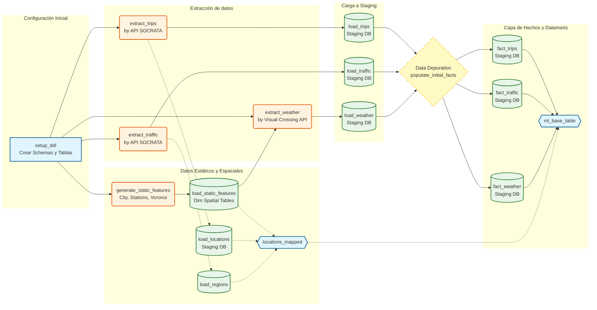
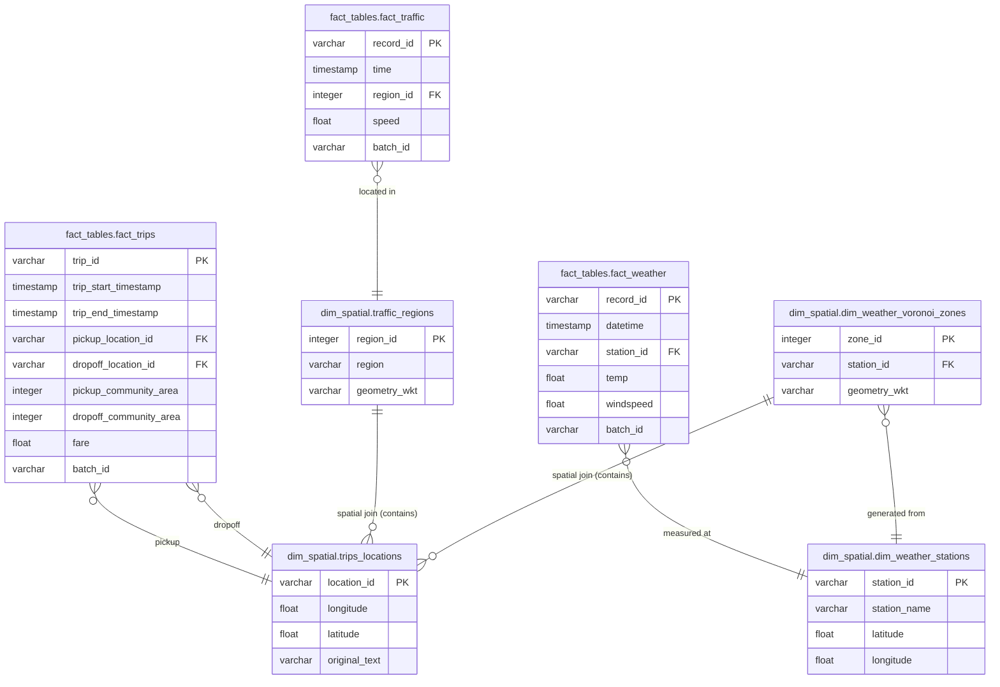

# Chicago Ridesharing Trips ETL
Proyecto de data engineering que implementa un pipeline ETL/ELT para extraer, procesar y analizar datos abierto de viajes de proveedores de redes de transporte (TNP) en la ciudad de Chicago.

## 🎯 Propósito del Pipeline

El objetivo principal de este proyecto es construir un sistema escalable para la ingesta, procesamiento y almacenamiento de datos públicos sobre viajes de ridesharing (como Uber y Lyft) en Chicago. El pipeline integra múltiples fuentes de datos para enriquecer la información de los viajes y consolidarla en un Data Warehouse para su posterior análisis y explotación.

Los componentes principales del pipeline son:

*   **Extracción (E):** Consume datos de tres fuentes principales a través de sus APIs:
    1.  **Viajes (Trips):** Datos detallados de cada viaje desde el portal de datos abiertos de Chicago.
    2.  **Tráfico (Traffic):** Información sobre la congestión vehicular en tiempo real.
    3.  **Clima (Weather):** Condiciones meteorológicas históricas por hora.
*   **Carga (L):** Carga los datos crudos extraídos en un área de Staging en una base de datos PostgreSQL, actuando como una capa intermedia antes de la transformación. 
*   **Transformación (T):** Depura y modela los datos desde el área de Staging para poblar un Data Warehouse con un esquema dimensional (tablas de hechos y dimensiones), y finalmente, crea vistas materializadas (Data Marts) optimizadas para consultas analíticas y de negocio. 

## 📁 Estructura del Repositorio
```
chicago_rstrips/
├── src/chicago_rstrips/    # Código fuente
├── tests/                   # Tests unitarios e integración
├── dags/                    # DAGs de Airflow
├── sql/                     # Scripts SQL
└── data/                    # Datos locales (no versionado)
```

## 🚀 Instalación y Despliegue con Docker

El proyecto está contenedorizado con Docker y utiliza Docker Compose para orquestar los servicios necesarios (Airflow, PostgreSQL).

1.  **Clonar el Repositorio:**
    ```bash
    git clone "https://github.com/tepeve/chicago_rstrips.git"
    cd chicago-rstrips
    ```

2.  **Configurar Variables de Entorno:**
    El manejo de entornos y dependencias está gestionado con uv. Crea un archivo `.env` en la raíz del proyecto. Tambíen podés crearlo desde cero pero vas a necesitar definir estas variables para desplegar el sistema:
    ```env
    # Credenciales para las APIs
    SOCRATA_APP_TOKEN="TU_APP_TOKEN_DE_SOCRATA"
    WEATHER_API_KEY="TU_API_KEY_DE_VISUALCROSSING"

    # Configuración de la Base de Datos (usada por Airflow y los scripts)
    POSTGRES_LOCAL_USER=
    POSTGRES_LOCAL_PASSWORD=
    POSTGRES_LOCAL_HOST=
    POSTGRES_LOCAL_PORT=
    POSTGRES_LOCAL_DB=

    # Configuración del webserver de airflow
    AIRFLOW__WEBSERVER__SECRET_KEY=
    ```
    > **Nota:** Las credenciales de la base de datos deben coincidir con las definidas en `docker-compose.yml` para que Airflow pueda conectarse. Podés generar tu `AIRFLOW__WEBSERVER__SECRET_KEY` propia corriendo la siguiente línea y guardando su resultado en el .env. 
    ```bash
    openssl rand -hex 32
    ```

3.  **Desplegar el proyecto:**
    Con este comando podés construir las imágenes y levantar todos los servicios (Airflow, Postgres, etc.) en una línea. 

    ```bash
    make run-project
    ```

4.  **Acceder a la UI de Airflow:**
    Abrí tu navegador y andá a `http://localhost:8080`. El usuario y contraseña por defecto son `admin`.

5.  ⚠️**Cómo ejecutar los DAGs:**
    *   **Cold Start:** Primero, activá y ejecutá manualmente el DAG `coldstart_etl_pipeline`. Este proceso inicializa la base de datos, carga todas las tablas y realiza unaprimera ingesta de datos históricos.
    *   **Batch Incremental:** Una vez que el `coldstart_etl_pipeline` haya finalizado con éxito, activá el DAG `batch_etl_pipeline`. Este se ejecutará diariamente (`@daily`) para procesar los nuevos datos de forma incremental.

## 🧬 Arquitectura y Flujo de Datos

El sistema se basa en dos DAGs de Airflow principales que orquestan todo el flujo ELT. 

### Diagrama de Flujo de los DAGs (ejemplo: coldstart_etl_pipeline)



### Componentes del Pipeline

*   **DAGs de Airflow (`dags/`):**
    *   [`coldstart_etl_pipeline.py`](dags/coldstart_etl_pipeline.py): Orquesta la configuración inicial del entorno. Crea el esquema de la base de datos, carga dimensiones estáticas (límites de la ciudad, estaciones meteorológicas) y realiza la ingesta masiva de datos para el período histórico definido. **Se ejecuta una sola vez.**
    *   [`batch_etl_pipeline.py`](dags/batch_etl_pipeline.py): Orquesta el proceso incremental diario. Extrae, carga y transforma los datos correspondientes a las últimas 24 horas. Espera a que el `coldstart_etl_pipeline` haya terminado exitosamente antes de su primera ejecución.

*   **Scripts de Extracción (`src/chicago_rstrips/`):**
    *   [`extract_trips_data.py`](src/chicago_rstrips/extract_trips_data.py): Se conecta a la API de Socrata para obtener datos de viajes.
    *   [`extract_traffic_data.py`](src/chicago_rstrips/extract_traffic_data.py): Obtiene datos de congestión vehicular de la API de Socrata.
    *   [`extract_weather_data.py`](src/chicago_rstrips/extract_weather_data.py): Obtiene datos climáticos de la API de Visual Crossing.

*   **Scripts de Carga y Base de Datos (`src/chicago_rstrips/`):**
    *   [`db_loader.py`](src/chicago_rstrips/db_loader.py): Contiene funciones genéricas para interactuar con PostgreSQL, como ejecutar DDLs y cargar DataFrames.
    *   [`load_facts_to_staging.py`](src/chicago_rstrips/load_facts_to_staging.py): Scripts para cargar datos de hechos (trips, traffic) a las tablas de staging.
    *   [`load_dim_*.py`](src/chicago_rstrips/load_dim_dynamic_tables.py): Scripts para cargar datos a las tablas de dimensiones.

*   **Scripts SQL (`sql/`):**
    *   Contienen las sentencias DDL para crear los schemas, tablas y vistas materializadas, así como las sentencias DML (UPSERT) para mover datos de Staging al Data Warehouse.

### Modelo de Datos (PostgreSQL)

El pipeline construye y puebla una base de datos PostgreSQL con los siguientes schemas:

*   `staging`: Almacena los datos crudos extraídos de las APIs.
*   `dim_spatial`: Contiene dimensiones geoespaciales estáticas y dinámicas.
*   `fact_tables`: Contiene las tablas de hechos que registran los eventos de negocio.
*   `data_marts`: Contiene vistas materializadas para análisis.

### Zoom-in a cómo se vinculan las facts tables de trips, traffic y weather:
Este modelo de asociación espacial se aplica en el script `join_spatial_dims.py` y se materializa en la tabla `dim_spatial.mapped_locations`. La dimensión temporal de la relación entre estas entidades se realiza en la vista materializada `datamarts.fact_trips_with_traffic_weather`.



## 🗃️ Visualización de la Base de Datos con Adminer

Para facilitar la exploración y validación de los datos, el `docker-compose` incluye **Adminer**, una herramienta ligera de gestión de bases de datos.

1.  **Acceder a Adminer:**
    Una vez que los contenedores estén corriendo, abrí tu navegador y andá a `http://localhost:8081`.

2.  **Iniciar Sesión:**
    Usá las siguientes credenciales para conectarte al Data Warehouse. Estos valores deben coincidir con los que definiste en tu archivo `.env`.

    *   **System:** `PostgreSQL`
    *   **Server:** `postgres_local_db` (es el nombre del servicio en `docker-compose.yml`)
    *   **Username:** El valor de `POSTGRES_LOCAL_USER`
    *   **Password:** El valor de `POSTGRES_LOCAL_PASSWORD`
    *   **Database:** El valor de `POSTGRES_LOCAL_DB`

    Una vez dentro, podrás navegar por los schemas (`staging`, `dim_spatial`, `fact_tables`, `data_marts`), ver el contenido de las tablas y ejecutar consultas SQL directamente desde la interfaz web.

## 📜 Descripción de Scripts Principales

A continuación se detallan los scripts más importantes del paquete `src/chicago_rstrips`.

#### `extract_trips_data.py`
*   **Overview:** Extrae datos de viajes de la API de Socrata para un rango de fechas, genera una dimensión de ubicaciones y guarda ambos como archivos Parquet.
*   **Lógica:**
    *  Construye una query SoQL con el rango de fechas especificado.
    *  Llama a la función `fetch_data_from_api` para obtener los datos.
    *  Si se indica (`build_locations=True`), extrae las coordenadas de `pickup` y `dropoff`, las desduplica y crea un DataFrame de dimensión de ubicaciones con un `location_id` único.
    *  Mapea los `location_id` de vuelta al DataFrame de viajes.
    *  Guarda el DataFrame de viajes y el de ubicaciones en formato Parquet en el directorio `data/raw/`.

#### `extract_traffic_data.py`
*   **Overview:** Extrae datos de tráfico de la API de Socrata y genera una dimensión de regiones de tráfico.
*   **Lógica:**
    *  Construye una query SoQL para obtener datos de tráfico por región.
    *  Obtiene los datos a través de `fetch_data_from_api`.
    *  Si se indica (`build_regions=True`), construye un GeoDataFrame con los polígonos de cada región de tráfico.
    *  Guarda los datos de tráfico y la dimensión de regiones en archivos Parquet.

#### `extract_weather_data.py`
*   **Overview:** Extrae datos meteorológicos por hora para un conjunto de estaciones.
*   **Lógica:**
    *  Obtiene la lista de estaciones meteorológicas desde la base de datos.
    *  Itera sobre cada estación y llama a la API de Visual Crossing para obtener el historial climático por hora en el rango de fechas especificado.
    *  Combina los resultados de todas las estaciones en un único DataFrame.
    *  Guarda el DataFrame resultante en formato Parquet.

#### `create_location_static_features.py`
*   **Overview:** Enriquece los datos de ubicaciones (pickup/dropoff) asignándoles el área comunitaria (community area) a la que pertenecen mediante un join espacial.
*   **Lógica:**
    *  Carga el archivo de polígonos con los límites de la Ciudad de Chicago.
    *  Definimos a mano cuatro ubicaciones de la Ciudad, según su cercanía al Lago Michigan y su latitud Norte-Sur que utilizaremos como estaciones meteorológicas.
    *  Tomamos esas ubicaciones como centroides para trazar un diagrama de Voronoi, que telesa en cuatro areas el plano de la Ciudad.
    *  Guardamos los DataFrames de ubicaciones como un archivo Parquet en la carpeta `features/geospatial`.

#### `db_loader.py`
*   **Overview:** Proporciona utilidades para interactuar con la base de datos PostgreSQL.
*   **Lógica:**
    *   `get_engine()`: Crea y devuelve un motor de SQLAlchemy para conectarse a la base de datos usando las credenciales del archivo `.env`.
    *   `run_ddl(ddl_path)`: Lee un archivo `.sql` y lo ejecuta en la base de datos. Se usa para crear tablas y schemas.
    *   `load_dataframe_to_postgres(...)`: Carga un DataFrame en una tabla de PostgreSQL. Si el modo es `append`, inspecciona la tabla de destino y carga solo las columnas que coinciden para evitar errores. Si es `replace`, elimina y vuelve a crear la tabla.    
    *   `load_parquet_to_postgres(...)`: Lee un archivo Parquet y lo carga en una tabla específica de PostgreSQL, gestionando la creación de la tabla si es necesario.

#### `join_spatial_dims.py`
*   **Overview:** Crea una tabla de mapeo (`dim_spatial.mapped_locations`) que vincula cada ubicación de viaje con su región de tráfico y zona meteorológica correspondiente.
*   **Lógica:**
    1.  Obtiene las ubicaciones de los viajes, los polígonos de las regiones de tráfico y las zonas de Voronoi de las estaciones meteorológicas desde la base de datos.
    2.  Realiza uniones espaciales (`spatial join`) para determinar qué región de tráfico y qué zona de Voronoi contiene cada punto de ubicación de viaje.
    3.  Guarda el resultado (un mapeo de `location_id` a `region_id` y `station_id`) en la tabla `dim_spatial.mapped_locations`.

#### `upsert_fact_tables.sql`
*   **Overview:** Transfiere y transforma datos desde las tablas de `staging` a las tablas de hechos (`fact_tables`).
*   **Lógica:**
    *  Utiliza una sentencia `INSERT INTO ... SELECT ...` para mover datos de `staging.stg_raw_trips` a `fact_tables.fact_trips`.
    *  Aplica una cláusula `ON CONFLICT (trip_id) DO UPDATE` para manejar registros duplicados, actualizando los existentes (UPSERT).
    *  Realiza el mismo proceso para las tablas de tráfico y clima.
    *  Filtra los registros a procesar según la ventana de tiempo de ejecución del DAG.

#### `create_data_marts.sql`
*   **Overview:** Crea vistas materializadas que integran las tablas tablas de hechos (`fact_tables`) para análisis futuros.
*   **Lógica:**
    *  Crea la vista materializada `dm_trips_hourly_pickup_stats` que agrega los viajes por hora y área de recogida para obtener estadísticas.
    *  Crea la vista materializada `fact_trips_with_traffic_weather` que enriquece cada viaje con los datos de tráfico y clima más cercanos en el tiempo.
    *  Crea una tabla base (`ml_base_table`) que integra las vistas anteriores y calcula características adicionales (features) usando funciones de ventana.

## 🧪 Testing

### Local
```bash
# Instalar el paquete en modo editable
uv pip install -e .

# Tests unitarios (rápidos, sin BD)
pytest -m unit -v

# Tests con coverage
pytest -m unit --cov=chicago_rstrips --cov-report=html

# Ver reporte de coverage
open htmlcov/index.html
```

### CI/CD
Los tests se ejecutan automáticamente en GitHub Actions en cada push y pull request.


## 🔗 Enlaces Útiles

*   **Dataset de Viajes (TNP) de la Ciudad de Chicago:**
    *   [Portal de Datos Abiertos](https://data.cityofchicago.org/Transportation/Transportation-Network-Providers-Trips-2025-/6dvr-xwnh/about_data)
    *   [Documentación de la API](https://dev.socrata.com/foundry/data.cityofchicago.org/6dvr-xwnh)
    *   [Manual de Reporte de TNP](https://chicago.github.io/tnp-reporting-manual/)
*   **Dataset de Tráfico de la Ciudad de Chicago:**
    *   [Documentación de la API](https://dev.socrata.com/foundry/data.cityofchicago.org/kf7e-cur8)
*   **API de Clima (Visual Crossing):**
    *   [Documentación de la API](https://www.visualcrossing.com/resources/documentation/weather-api/timeline-weather-api/)
*   **Socrata (Plataforma de Datos Abiertos):**
    *   [Documentación de Queries (SoQL)](https://dev.socrata.com/docs/queries/)
